# A Gentle Introduction to Genetic Algorithms

It may not seem obvious at first glance, but computer science algorithms are often inspired by nature and biological processes. Some of these algorithms include neural networks, particle swarm optimization, artificial bee colony, ant colony optimization, evolutionary algorithms and many more. In fact some even have the view that biological processes are simply algorithms that nature have come up with to solve problems.

From that point of view it's easy to see why many of these algorithms are optimization heuristics and metaheuristics. [Heuristics](https://stackoverflow.com/questions/2334225/what-is-the-difference-between-a-heuristic-and-an-algorithm), in case the term is not familiar to you, are algorithms that try to solve the problem faster by making some assumptions. As you can imagine, heuristics are often not optimal but are more useful in cases when getting the optimal results take way too long. [Metaheuristics](https://www.researchgate.net/post/What_are_the_differences_between_heuristics_and_metaheuristics) take this to the next level -- they are a heuristic that generates or finds heuristics.  

## Genetic algorithms

Genetic algorithms are metaheuristics that are based on the process of [natural selection](https://en.wikipedia.org/wiki/Natural_selection). 

Natural selection, as a refresher, is a key mechanism in evolution. It is a natural process that causes populations (of organisms) to adapt to their environment over time. These populations have variations in traits. Individual organisms with more suitable traits have higher chances of survival in the environment. The next generations reproduced from these surviving organisms will inherit their traits, resulting eventualy in a population with these more suitable traits. 

However if the entire population have the same traits, and the environment changes, this will result in extinction. Fortunately mutations that occur occasionally causes variations in traits and these allows traits that are more suited for the changed environment to survive and become the dominant trait.

A popularly used illustration is the [variation in color in the peppered moths in England](https://en.wikipedia.org/wiki/Peppered_moth_evolution). Before the early 1800s, the peppered moth in England were mostly of the white variety and its coloration helped it to hide from predatory birds as it blended well with light-colored lichens and English trees. However during the Industrial Revolution, light-colored lichens died due to pollution and many of the trees on which the moths rested became blackened by soot. This gave the dark colored moths an advantage in hiding from predators while the light colored moths were easily spotted. By the mid 1800s, the number of dark colored moths increased and by the end of the century, almost all peppered moths were of the dark variety. The balance was reversed by the effect of the Clean Air Act 1956, and the dark colored moths became rare again.


So that's natural selection. How does genetic algorithms come into the picture? Genetic algorithms are heuristics that uses the same mechanisms as natural selection --  DNA, population, variation, fitness, selection, reproduction, inheritance and mutation.

* DNA -- define organisms that have one or more DNA
* Population -- start with an initial population of organisms with different genes (values) for their DNA
* Fitness -- determine the fitness of each organism to its environment
* Selection -- select the organisms with the best fitness and give them higher chances to reproduce
* Reproduction -- create the next generation of the population from the selected best-fit organisms 
* Inheritance -- the next generation of the population must inherit the values of the genes
* Mutation -- with each generation, there is a small chance that the values of the genes changes

## Monkeys, typewriters and Shakespeare

The [infinite monkey theorem](http://www.ietf.org/rfc/rfc2795.txt) says that an infinite number of monkeys sitting at an infinite number of typewriters randomly hitting keys, given enough time, will eventually reproduce the complete works of Shakespeare. Let's say we want just one monkey to reproduce this quote: _"To be or not to be"_ How long do you think it will take the monkey to randomly hammer this out?


The quote has 18 characters (including space). The probability of the monkey typing _'t'_ (let's be generous and say it's ok to be all small caps) is 1 out of 26. So the probability of typing the exact sequence _"To be or not to be"_ is 1 out of 26 to the power of 18 or 1 out of about 29,479,510,200,013,920,000,000,000. If let's say the monkey type a letter every second, there is just 1 chance out of 934,789,136,225,707,600 years that it will type out that quote. That's 1 time in 934 trillion years.

Obviously the brute force way of doing this is not going to get us anywhere. What if we try to 'evolve' the quote? Let's look at how we can use genetic algorithms to do this. Here are the steps for a genetic algorithm used to solve the problem:

### Define a organism consisting of one or more DNA

An organism in our Shakespeare-spouting algorithm consists of a single DNA, which is a byte array and a number representing the fitness of the Organism. 

```go
type Organism struct {
	DNA    []byte
	Fitness float64
}
```

### Start with an initial population of organisms

We need to create organisms for our initial population, so here's a function to do that.

```go
func createOrganism(target []byte) (organism Organism) {
	ba := make([]byte, len(target))
	for i := 0; i < len(target); i++ {
		ba[i] = byte(rand.Intn(95) + 32)
	}
	organism = Organism{
		DNA:    ba,
		Fitness: 0,
	}
	organism.calcFitness(target)
	return
}
```

The `target` is what we want to achieve, in this case it is the byte array representation of the string 'to be or not to be'. In this function we randomly create a byte array of the same length as the target and set that as the value of the gene in the newly created Organism. 

Now that we can create Organisms, we need to create a population of them.

```go
func createPopulation(target []byte) (population []Organism) {
	population = make([]Organism, PopSize)
	for i := 0; i < PopSize; i++ {
		population[i] = createOrganism(target)
	}
	return
}
```

The `population` is an array of Organisms while `PopSize` is a global variable defining the size of the population.

### Find the fitness of the organisms

We need to calculate the fitness of organisms in our population. This was called earlier in when we created the Organism but will also be called later when we crossover Organisms. 

```go
func (d *Organism) calcFitness(target []byte) {
	score := 0
	for i := 0; i < len(d.DNA); i++ {
		if d.DNA[i] == target[i] {
			score++
		}
	}
	d.Fitness = float64(score) / float64(len(d.DNA))
	return
}
```

This fitness function is relatively simple. We simply count the number of times the bytes in the gene matches the target. The score is divided by the total number of bytes in the target in order to get the fitness to be a percentage i.e. a number between 0.0 and 1.0. This means if the fitness is 1.0, we would have evolved the Organism's gene to match the quote 'to be or not to be'.

### Select the organisms with the best fitness and give them higher chances to reproduce

Now that we have a population, and we can figure out which organisms have the best fitness, we want to pick the best fit organisms and let them reproduce to create the next generation of population. There are many different ways of doing this but in this case we're using a 'breeding pool' mechanism. 

```go
func createPool(population []Organism, target []byte, maxFitness float64) (pool []Organism) {
	pool = make([]Organism, 0)
	// create a pool for next generation
	for i := 0; i < len(population); i++ {
		population[i].calcFitness(target)
		num := int((population[i].Fitness / maxFitness) * 100)
		for n := 0; n < num; n++ {
			pool = append(pool, population[i])
		}
	}
	return
}
```

What we do is to create a sort of breeding pool where I place a number of copies of the same organism according to its fitness into the pool. The higher the fitness of the organism, the more copies of the organism end up in the pool. 

### Create the next generation of the population from the selected best-fit organisms 

After that we randomly pick 2 organisms from the breeding pool and use them as the parents to create the next generation of organism for the population.

```go
func naturalSelection(pool []Organism, population []Organism, target []byte) []Organism {
	next := make([]Organism, len(population))

	for i := 0; i < len(population); i++ {
		r1, r2 := rand.Intn(len(pool)), rand.Intn(len(pool))
		a := pool[r1]
		b := pool[r2]

		child := crossover(a, b)
		child.mutate()
		child.calcFitness(target)

		next[i] = child
	}
	return next
}
```

### The next generation of the population must inherit the values of the genes

The `child` in the next generation is then bred from the the crossover between 2 randomly picked organisms, and _inherits_ the DNA from both organisms.

```go
func crossover(d1 Organism, d2 Organism) Organism {
	child := Organism{
		DNA:    make([]byte, len(d1.DNA)),
		Fitness: 0,
	}
	mid := rand.Intn(len(d1.DNA))
	for i := 0; i < len(d1.DNA); i++ {
		if i > mid {
			child.DNA[i] = d1.DNA[i]
		} else {
			child.DNA[i] = d2.DNA[i]
		}

	}
	return child
}
```

For crossover, I simply picked a mid-point `mid` and use the first `mid` bytes from the first organism and the rest of the bytes from the second organism. 

## Randomly mutate each generation

After a new child organism has been reproduced from the 2 parent organisms, we see if mutation happens to the child organism.

```go
func (d *Organism) mutate() {
	for i := 0; i < len(d.DNA); i++ {
		if rand.Float64() < MutationRate {
			d.DNA[i] = byte(rand.Intn(95) + 32)
		}
	}
}
```

Here mutation simply means determine if a randomly generated number is below `MutationRate`. Why do we need to mutate the child organism? If mutation never occurs, the DNA within the population will always remain the same as the original population. This means if the original population doesn't have a particular gene(value) that is needed, the optimal result will never be achieved. As in the example, if the letter `t` is not found in the initial population at all, we will never be able to come up with the quote no matter how many generations we go through. In other words, natural selection doesn't work without mutations. 

More technically speaking, mutations get us out of a local maximum in order to find the global maximum. If we look at genetic algorithms as a mechanism to find the optimal solution, if we don't have mutation, once a local maximum is found the mechanism will simply settle on that and never moves on to find the global maximum. Mutations can jolt the population out of a local maximum and therefore provide an opportunity for the algorithm to continue looking for the global maximum.

Once we check for mutation, we calculate the fitness of the child organism and insert it into the next generation of population.

That's all there is to the genetic algorithm! Now let's put it all together in the `main` function.

```go
func main() {
	start := time.Now()
	rand.Seed(time.Now().UTC().UnixNano())

	target := []byte("To be or not to be")
	population := createPopulation(target)

	found := false
	generation := 0
	for !found {
		generation++
		bestOrganism := getBest(population)
		fmt.Printf("\r generation: %d | %s | fitness: %2f", generation, string(bestOrganism.DNA), bestOrganism.Fitness)

		if bytes.Compare(bestOrganism.DNA, target) == 0 {
			found = true
		} else {
			maxFitness := bestOrganism.Fitness
			pool := createPool(population, target, maxFitness)
			population = naturalSelection(pool, population, target)
		}

	}
	elapsed := time.Since(start)
	fmt.Printf("\nTime taken: %s\n", elapsed)
}
```

In the main function we go through generations and for each generation we try to find the best fit organism. If the best fit organism's gene is the same as the target we would have found our answer. 

Now run the software program! How long did it take you? 


Because the initial population is randomly generated, you will get different answers each time but most of the time we can evolve the quote in less than a second! That's quite a vast difference from the 934 trillion years if we had to brute force it.

## Evolving Mona Lisa

Evolving Shakespeare seems pretty simple. It's just a string after all. How about something different, say an image? Or the most famous painting of all time, the _Mona Lisa_ by Leonardo Da Vinci? Can we evolve that?


Let's give it the same treatment. We'll start from defining the organism to represent the picture of Mona Lisa.

### Define a organism consisting of one or more DNA

Instead of a byte array, our DNA is now a struct from the `image` standard library.

```go
type Organism struct {
	DNA     *image.RGBA
	Fitness int64
}
```

### Start with an initial population of organisms

As before let's look at creating an organism first.

```go
func createOrganism(target *image.RGBA) (organism Organism) {
	organism = Organism{
		DNA:     createRandomImageFrom(target),
		Fitness: 0,
	}
	organism.calcFitness(target)
	return
}
```

Instead of creating a random byte array, we call another function to create a random image.

```go
func createRandomImageFrom(img *image.RGBA) (created *image.RGBA) {
	pix := make([]uint8, len(img.Pix))
	rand.Read(pix)
	created = &image.RGBA{
		Pix:    pix,
		Stride: img.Stride,
		Rect:   img.Rect,
	}
	return
}
```

An `image.RGBA` struct consists of a byte array `Pix` (`byte` and `uint8` are the same thing), a `Stride` and a `Rect`. What's important for us is the `Pix`, we use the same `Stride` and `Rect` as the target image (which is an image of Mona Lisa). Fortunately for us, the `math/rand` standard library has a method called `Read` that fills up a byte array nicely with random bytes. 

You might be curious, so how big a byte array are we talking about here? `Pix` is nothing more than a byte array with 4 bytes representing a pixel (R, G, B and A each represented by a byte).  With an image that is 800 x 600, we're talking about 1.92 million bytes in each image! To keep the program relatively speedy, we'll use a smaller image that is of size 67 x 100, which gives an array of 26,800 bytes. This, if you don't realise it by now, is far from the 18 bytes we were playing around with in the last program.

Also, you might realise that because each pixel is now randomly colored, we'd end up with a colored static snow pattern.

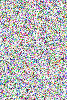

Let's move on.

### Find the fitness of the organisms

The fitness of the organism is the difference between the two images. 

```go
func (o *Organism) calcFitness(target *image.RGBA) {
	difference := diff(o.DNA, target)
	if difference == 0 {
		o.Fitness = 1
	}
	o.Fitness = difference

}

func diff(a, b *image.RGBA) (d int64) {
	d = 0
	for i := 0; i < len(a.Pix); i++ {
		d += int64(squareDifference(a.Pix[i], b.Pix[i]))
	}

	return int64(math.Sqrt(float64(d)))
}

func squareDifference(x, y uint8) uint64 {
	d := uint64(x) - uint64(y)
	return d * d
}
```

To find the difference, we can go back to the Pythagorean theorem. If you remember, we can find the distance between 2 points if we square the difference of the `x` and `y` values, add them up and then square root the results.

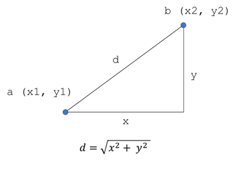

Give 2 points `a`(x1, y1) and `b`(x2, y2), the distance `d` between `a` and `b` is:

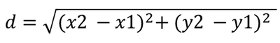

That's in 2 dimensional space. In 3 dimensional space, we simply do the Pythagorean theorem twice, and in 4 dimensional space, we do it 3 times. The RGBA values of a pixel is essentially a point in a 4 dimensional space, so to find the difference between 2 pixels, we square the difference between `r`, `g`, `b` and `a` values of two pixels, add them all up and then square root the results.

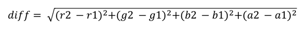

That's the difference between 2 pixels. To find the difference between all pixels, we just add up all the results together and we have the final difference. Because `Pix` is essentially one long byte array with consecutive RGBA values in it we can use a simple shortcut. We simply square the difference between each corresponding byte in the image and the target, then add them all up and square root the final number to find the difference between the 2 images.

As a reference, if 2 images are exactly the same, the difference will be 0 and if the 2 images are complete opposites of each other, the difference will be 26,800. In other words, the best fit organisms should have fitness of 0 and the higher the number is, the less fit the organism is.

### Select the organisms with the best fitness and give them higher chances to reproduce

We're still using the breeding pool mechanism here but with a difference. First, we sort the population from best fitness to worst fitness. Then we take the top best organisms and put them into the breeding pool. We use a parameter `PoolSize` to indicate how many of the best fit organisms we want in the pool. 

To figure out what to put into the breeding pool, we subtract each of the top best organisms with the least fit organism in the top. This creates a differentiated ranking between the top best organisms and according to that differential ranking we place the corresponding number of copies of the organism in the breeding pool. For example, if the difference between the best fit organism and the least fit organism in the top best is 20, we place 20 organisms in the breeding pool.

If there is no difference between the top best fit organisms, this means the population is stable and we can't really create a proper breeding pool. To overcome this, if the difference is 0, we set the pool to be the whole population.

```go
func createPool(population []Organism, target *image.RGBA) (pool []Organism) {
	pool = make([]Organism, 0)
	// get top best fitting organisms
	sort.SliceStable(population, func(i, j int) bool {
		return population[i].Fitness < population[j].Fitness
	})
	top := population[0 : PoolSize+1]
	// if there is no difference between the top  organisms, the population is stable
	// and we can't get generate a proper breeding pool so we make the pool equal to the
	// population and reproduce the next generation
	if top[len(top)-1].Fitness-top[0].Fitness == 0 {
		pool = population
		return
	}
	// create a pool for next generation
	for i := 0; i < len(top)-1; i++ {
		num := (top[PoolSize].Fitness - top[i].Fitness)
		for n := int64(0); n < num; n++ {
			pool = append(pool, top[i])
		}
	}
	return
}
```

### Create the next generation of the population from the selected best-fit organisms 

After we have the pool, we need to create the next generation. The code for natural selection here is no different from the previous program so we'll skip showing it here.

### The next generation of the population must inherit the values of the genes

The `crossover` function is slightly different as the child's DNA is not a byte array but an image.RGBA. The actual crossover mechanism works on `Pix`, the byte array of pixels, instead.

```go
func crossover(d1 Organism, d2 Organism) Organism {
	pix := make([]uint8, len(d1.DNA.Pix))
	child := Organism{
		DNA: &image.RGBA{
			Pix:    pix,
			Stride: d1.DNA.Stride,
			Rect:   d1.DNA.Rect,
		},
		Fitness: 0,
	}
	mid := rand.Intn(len(d1.DNA.Pix))
	for i := 0; i < len(d1.DNA.Pix); i++ {
		if i > mid {
			child.DNA.Pix[i] = d1.DNA.Pix[i]
		} else {
			child.DNA.Pix[i] = d2.DNA.Pix[i]
		}

	}
	return child
}
```

## Randomly mutate each generation

The `mutate` function is correspondingly different as well.

```go
func (o *Organism) mutate() {
	for i := 0; i < len(o.DNA.Pix); i++ {
		if rand.Float64() < MutationRate {
			o.DNA.Pix[i] = uint8(rand.Intn(255))
		}
	}
}
```

Now that we have everything, we put it all together in the `main` function.

```go
func main() {
	start := time.Now()
	rand.Seed(time.Now().UTC().UnixNano())
	target := load("./ml.png")
	printImage(target.SubImage(target.Rect))
	population := createPopulation(target)

	found := false
	generation := 0
	for !found {
		generation++
		bestOrganism := getBest(population)
		if bestOrganism.Fitness < FitnessLimit {
			found = true
		} else {
			pool := createPool(population, target)
			population = naturalSelection(pool, population, target)
			if generation%100 == 0 {
				sofar := time.Since(start)
				fmt.Printf("\nTime taken so far: %s | generation: %d | fitness: %d | pool size: %d", sofar, generation, bestOrganism.Fitness, len(pool))
				save("./evolved.png", bestOrganism.DNA)
				fmt.Println()
				printImage(bestOrganism.DNA.SubImage(bestOrganism.DNA.Rect))
			}
		}
	}
	elapsed := time.Since(start)
	fmt.Printf("\nTotal time taken: %s\n", elapsed)
}
```

Now run it and see. What do you get?

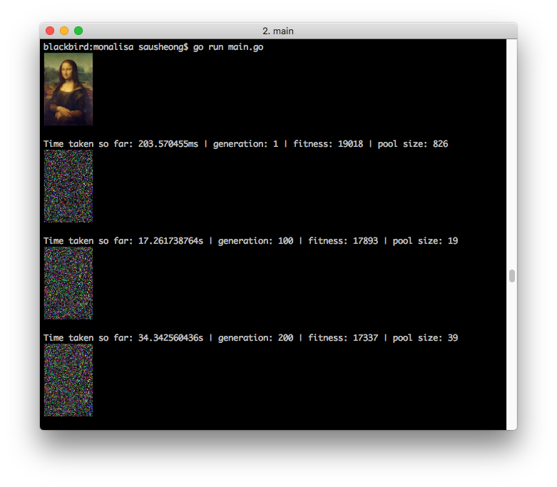


With the parameters I've set, when I run it, I usually start with a fitness of 19,000 or so. On an average it takes me more than 20 minutes before I reach a fitness of less than 7500.

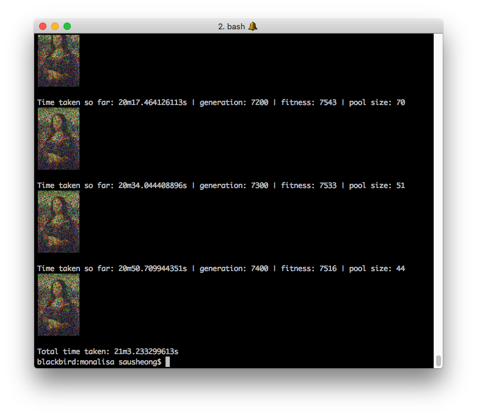

Here's a sequence of images that's been produced over time:


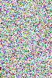
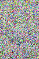
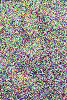
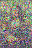
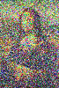

## Evolving Mona Lisa with circles and triangles

I had a bit of fun with evolving Mona Lisa by drawing circles and also drawing triangles on an image. The results weren't as quick and the images were not as obvious but it shows a glimpse of what actually happens. You can check out the rest of the code from the repository and tweak the parameters yourselves to see if you can get better pictures but here are some images I got.

### Mona Lisa triangles

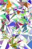
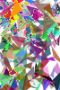
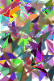
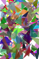
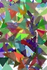

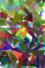

### Mona Lisa circles


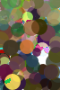
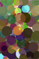
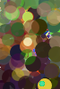

Have fun!